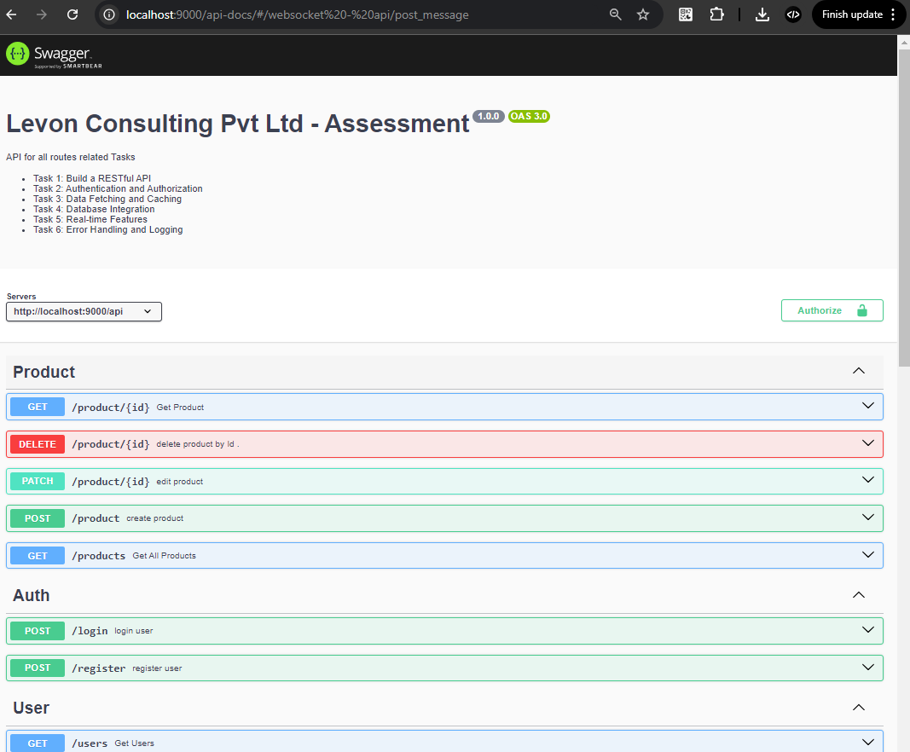
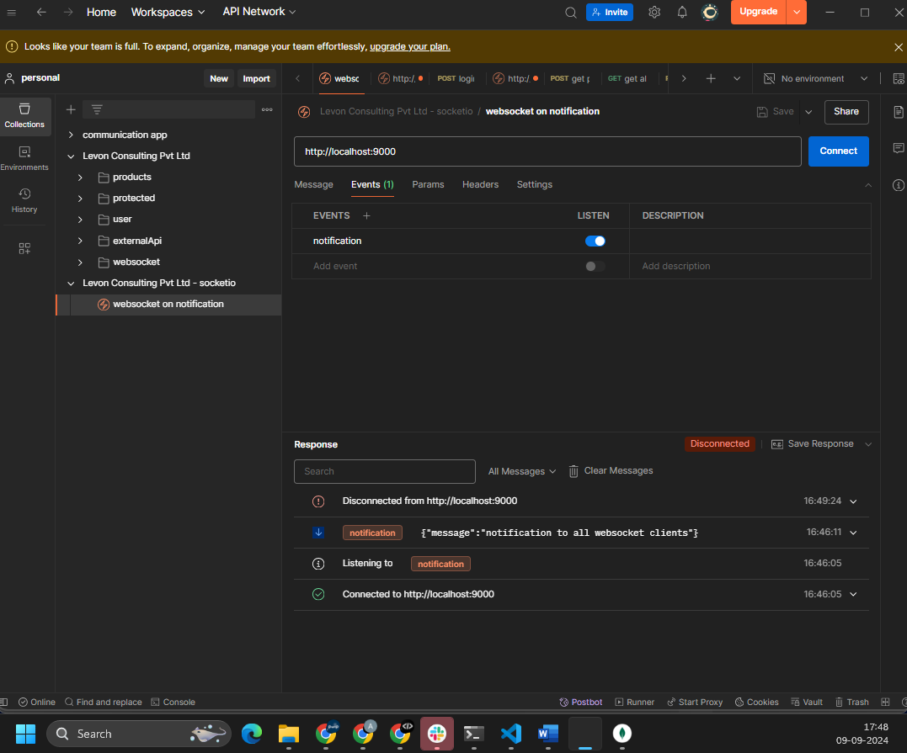

# Backend Task 

Brief description of your project, including its purpose and main features.
host at (base_url) -  http://13.60.216.166/

## Tasks
- Task 1: Build a RESTful API
- Task 2: Authentication and Authorization
- Task 3: Data Fetching and Caching
- Task 4: Database Integration
- Task 5: Real-time Features
- Task 6: Error Handling and Logging


## Deployment details 
1. **Hosted in AWS EC2 Instance**: The application is deployed on an EC2 instance, which is a virtual server in Amazon's cloud environment . both redis and express server running in ec2 instance - its a free tier so might have slow loading.

2. **Using PM2 Process Management**: PM2 is a process manager for Node.js applications. 

3. **CI/CD Pipeline via GitHub Actions**: Continuous Integration and Continuous Deployment (CI/CD) is set up using GitHub Actions. It automates the process of  deploying code changes. When new code is pushed to **main** branch of the GitHub repository , GitHub Actions triggers a workflow that automatically deploys it to the EC2 instance.

4.**Deployed Redis in the Same Instance**: Redis, an in-memory data structure store used as a database or cache, is installed on the same EC2 instance as the application. Redis helps in improving the performance by caching frequently accessed data , currently used in **GET /api/weather**

5.**Used Nginx for Proxy**: Nginx is used as a reverse proxy server. It routes client requests to the appropriate backend service (express app running under PM2)

## Deployed Swagger Documentation
Goto - [Swagger-doc hosted ](http://13.60.216.166/api-docs)


## Prerequisites

- **Node.js** (version v14.16.1 preferred .)
- **npm**
- Make run Redis server in **localhost:6379**

## Installation

1. Clone the repository:

   ```bash
   git clone https://github.com/Akhancode/Levon-Consulting-Pvt-Ltd---Assessment.git
   
2. Install all dependencies:

   ```bash
   cd Levon-Consulting-Pvt-Ltd---Assessment
   npm install
   
3. Download and setup Redis Server in localhost:
   
   [Setting up Redis](https://redis.io/docs/latest/operate/oss_and_stack/install/install-redis/install-redis-on-windows)

4. visit Swagger API Documentation :
   baseURL/api-docs
   eg: http://localhost:9000/api-docs

   

4. POSTMAN collection :
   - For websocket please do like screenshot 

   

    - For API - endpoints import these collection via URL
       - https://api.postman.com/collections/30275964-357aa4eb-6581-4d3d-81f7-b9542adb21e1?access_key=PMAT-01J7BBPY185VRGB0RW8BVRVGGF


## Architecture/design explanation
### Directories are : 
**Model**: Defines the structure of your data and interacts with the database. It represents the data layer of your application.

**Controller**: Handles incoming requests, processes them, and returns responses. It acts as the middleman between the model and the view.

**Route**: Defines the endpoints (URLs) of your application and maps them to specific controller functions.

**Service**: Contains the business logic and operations that are often reused across different parts of the application. It sits between the controller and the model.

**Utils**: Provides utility functions or helpers that perform common tasks across the application.inside this we have errorClasses , redis Functions , constants etc ..

**Middleware**: This  functions will execute and pass to the next function , mainly used for validating Token , Error Handler and monitor-logs.

**Socket**: Manages real-time communication, such as chat or notifications, using WebSockets.

### root Files are :
**server.js** : this will be the initial call  and inside this make a call **app.js** ,and create the server , End it creates the socket connection . 


